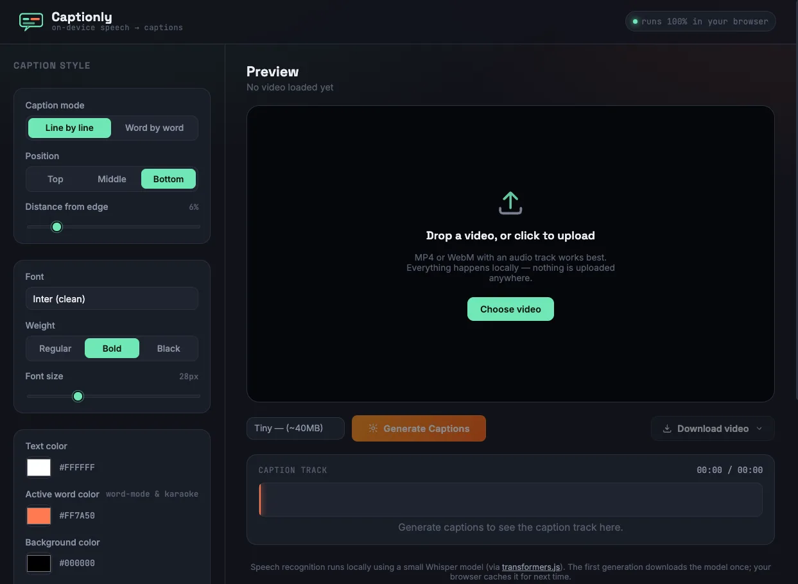

# Captionly
Add captions to your videos using local AI entirely in your browser. Select a video, edit and style captions live, then export a captioned video or SRT — no uploads, login, servers, or API keys.

### Features
- AI transcription with word-level timestamps
- Live caption styling (font, color, size, position, background, etc.)
- Edit captions without re-transcribing
- Export burned-in captions or SRT subtitles

### How it works
- Upload a video.
- Audio is extracted and transcribed locally using Whisper via transformers.js.
- Style or edit captions in real time.
- Export the captioned video or an SRT file.

### Notes
- Everything runs locally — your video never leaves your device.
- Models are downloaded once and cached by your browser.
- Larger models are slower but produce more accurate captions.
- MP4 export works best in Chromium-based browsers.

### Made with [Claude](https://claude.ai/)
99% of this project was written by Claude, only 1% manual code tweaks were applied. 

Here are the prompts used to generate this project:
1. > create a ai video captions generator web app, user uploads vides and it automatically adds caption. it uses browser based ai models with transformer js/onnx to transcribe videos audio to text, then based on that and video time etc it automaically adds captions to vidoes. on left: controls eg font, font size, text/bg color, line by line or world by word captions, potision, padding , border radius etc, on right: preview with download button. Show loader when generating or downloading/loading models. models get cached for next page visits

2. > it mostly works but i uploaded a portrait format video and captions are getting out of videos aspect ratio should be preserved also I should be able to click/play the preview videos to see how it looks and after generation when i change controls I should see changes in caption immediately insted of having to click generate captions againand again

3. > nice, now can you make it so when i click on one of the green caption boxed it open a input with caption texts filled in. So if there is spelling mistake or something I need to change i can edit text and save it

4. > when clicked on download video open a drowdown for format eg as mp4, as webm etc

5. > another thing  when we choose top or bottom position also show a slider to change how much from top or bottom should the position be

6. > ohh another thing since click on a box of caption open a modal to edit text now i cant easily go to a specific time to preview so make it so clicking one goes to a specific time of preview and double clicking opens the modal to edit text also Caption track should be scrollable

7. > the scrollbar looks a bit ugly can you make it look nice also when track is empty say 'Generate captions to see the caption track here. and when captions generated say 'Click a segment to jump there, double-click to edit its text.'

8. > pressing spacebar should play pause preview also captions tract should also scroll if preview is playing and current position is out of view

9. > can we also add download as SRT so just downloads as subtitle file

10. > when rendering also way stay in this tab and don't let your computer go to sleep. If possible use javascpit to prevent computer from going to sleep during export

11. > right now we only have one fix small ai model can we let user chose between tiny,medium and large model

12. > can you write a short github readme.md for it what it is how it work etc keep it short

13. > looks like when i upload longer videos the app takes a long time. can you update the codes for more longer videos it generates captions for few minutes of video at a time? also add appropriate loaders and update statuses 